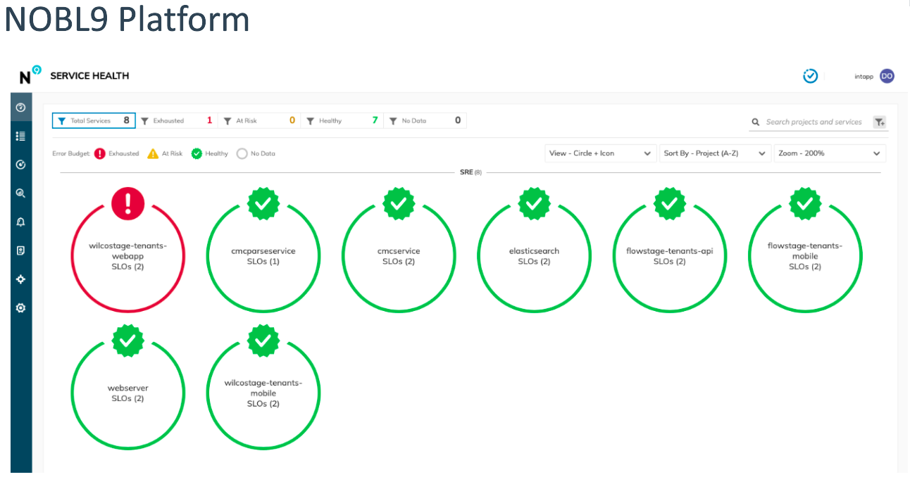
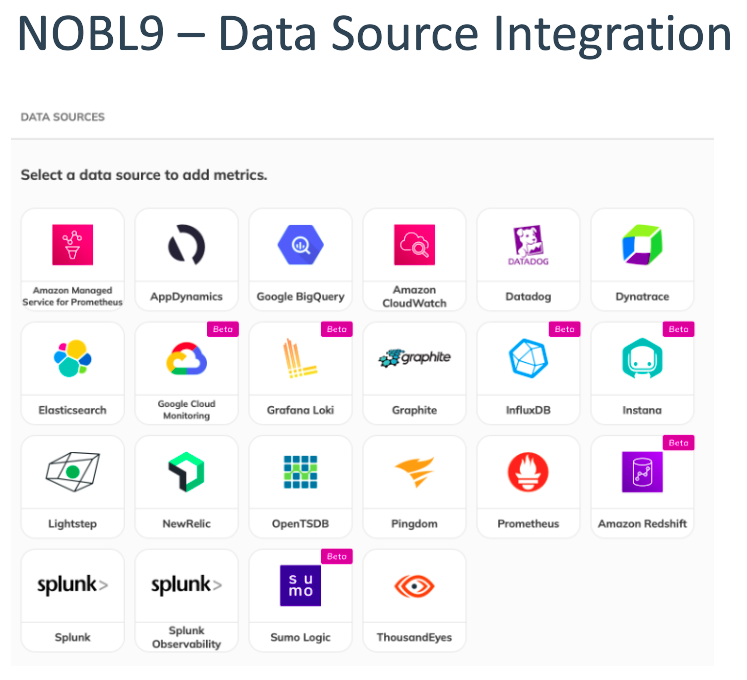
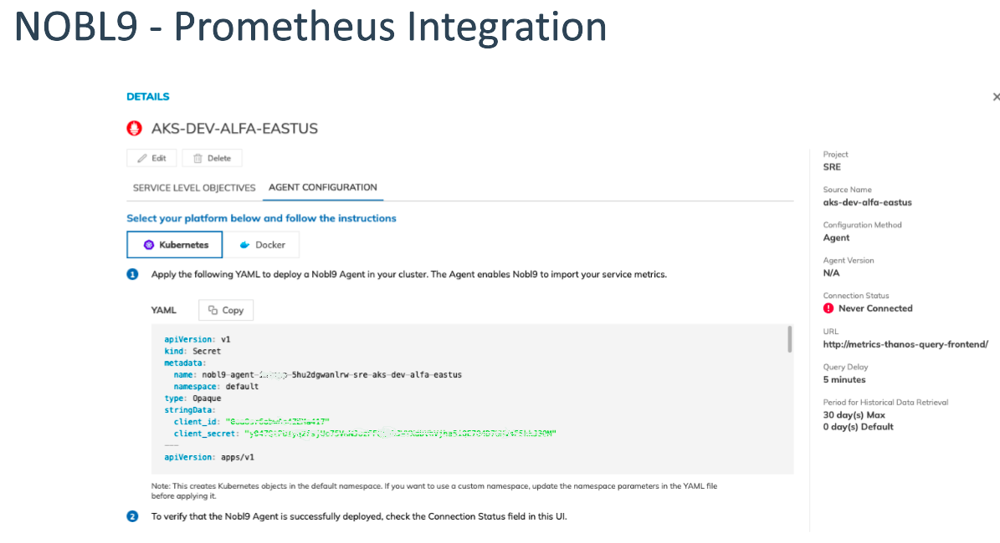

Author: Danilo Oliveira - SRE
Date: 2023/09

# Nobl9 – SLO management​

The Nobl9 Platform provides a common understanding of reliability across your organization by defining Service Level Objectives (SLOs). Our SaaS-based platform collects Service Level Indicator (SLI) metrics from your existing observability systems and tracks error budgets across platforms and applications.​

[Create SLOs from Your Existing Observability Data​](https://docs.nobl9.com/Getting_Started/)

[Define Your SLOs as Code​](https://docs.nobl9.com/sloctl-user-guide)

[Adjust Your SLOs with SLI Analyzer ](https://docs.nobl9.com/SLI_Analyzer/)

[Backfill Your SLO Reporting with Replay](https://docs.nobl9.com/replay)

[Monitor Your SLOs on the Dashboard​](https://docs.nobl9.com/Features/service-health-dashboard)

[Get Notified when Your Budget Burns Too Fast​](https://docs.nobl9.com/Alerting/)

[Add Notes to your Metrics to Improve Reliability](https://docs.nobl9.com/Features/SLO_Annotations/)

